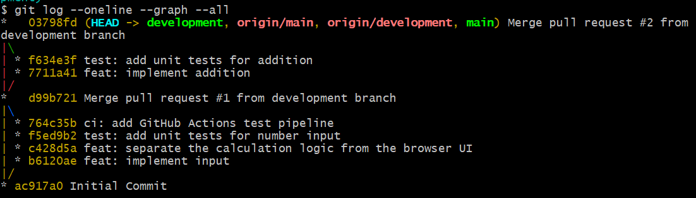
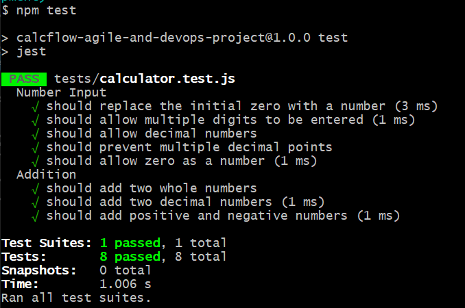
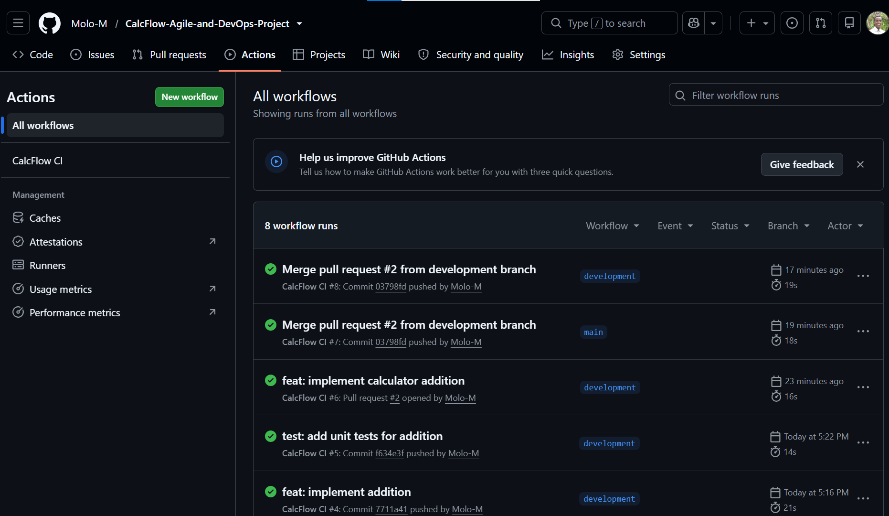
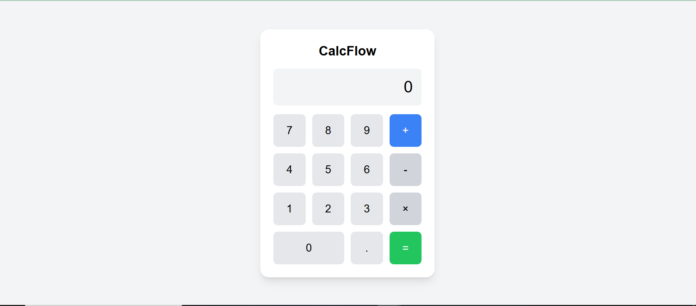
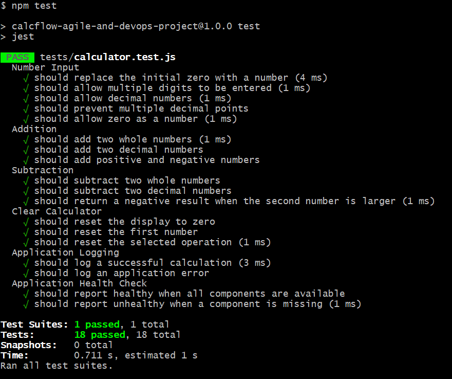
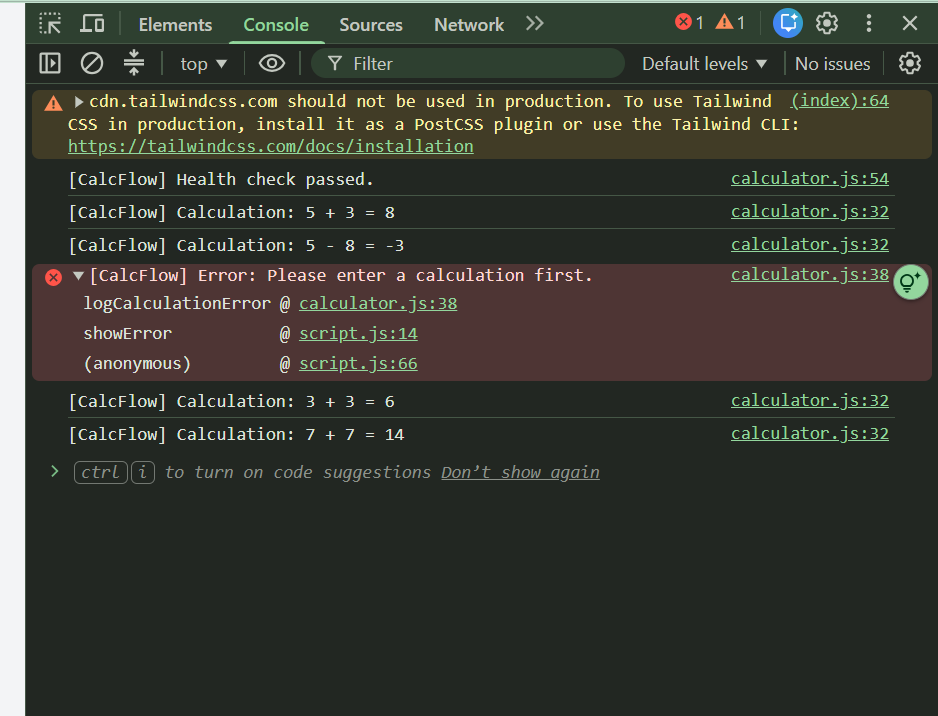
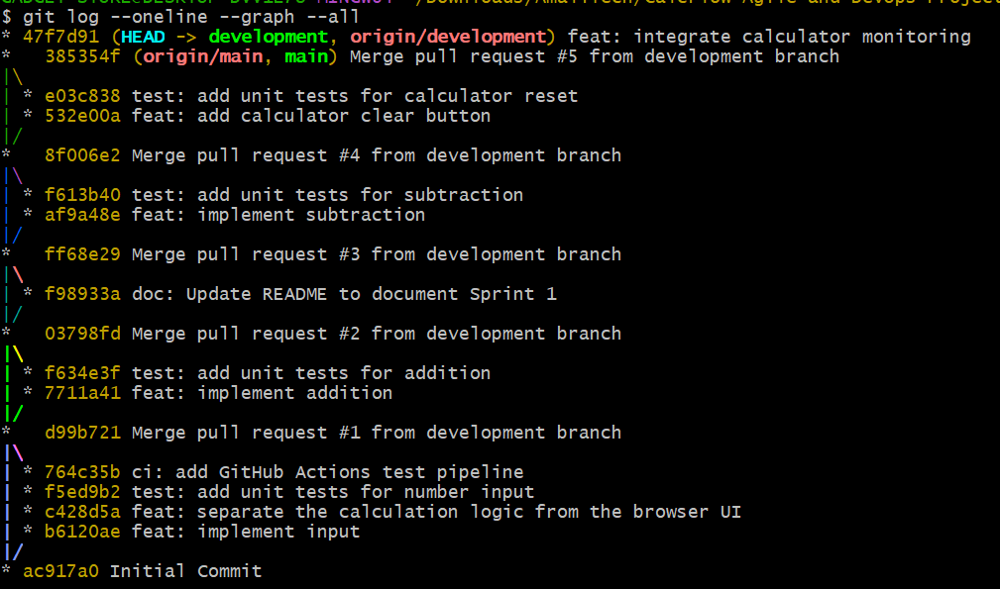

# CalcFLow - Agile & DevOps in Practice

A project demonstrating my ability to independently apply Agile principles and DevOps practices to plan, execute, and iteratively deliver a working solution.

The emphasis is not on the size of the product, but on how effectively you apply Agile and DevOps practices throughout the process.

## Table of Content:

* ## [Sprint 0 - Planning](#sprint-0---planning)
* [1. Product Vision](#1-product-vision)
* [2. Product Backlog](#2-product-backlog)
* [3. Acceptance Criteria](#3-acceptance-criteria)
* [4. Definition of Done](#4-definition-of-done)
* ## [Sprint 1 - Execution](#sprint-1---execution)
* [1. Backlog Items Delivered](#1-backlog-items-delivered)
* [2. Commit History](#2-commit-history)
* [3. Unit Tests and CI Pipeline](#3-unit-tests-and-ci-pipeline)
* [4. Sprint 1 Review](#4-sprint-1-review)
* [5. Sprint 1 Retrospective](#5-sprint-1-retrospective)
* ## [Sprint 2 - Execution & Improvement](#sprint-2---execution--improvement)
* [1. Backlog Items Delivered, Monitoring & Unit Tests](#1-backlog-items-delivered-monitoring--unit-tests)
* [2. Final Commit History](#2-final-commit-history)
* [3. Sprint 2 Review](#3-sprint-2-review)
* [4. Sprint 2 Retrospective](#4-sprint-2-retrospective)

## Sprint 0 - Planning

### 1. Product Vision

CalcFlow is a simple web-based arithmetic calculator that allows users to perform basic calculations quickly and reliably. The project demonstrates Agile and DevOps practices through incremental development, automated testing, continuous integration, and iterative improvement.

### 2. Product Backlog

| ID  | User Story                                                                                            | Priority | Story Points |
| --- | ----------------------------------------------------------------------------------------------------- | -------- | -----------: |
| US1 | As a user, I want to enter numbers into the calculator so that I can perform calculations.            | Must     |            2 |
| US2 | As a user, I want to add two numbers so that I can calculate their sum.                               | Must     |            2 |
| US3 | As a user, I want to subtract two numbers so that I can calculate their difference.                   | Must     |            2 |
| US4 | As a user, I want to multiply two numbers so that I can calculate their product.                      | Must     |            2 |
| US5 | As a user, I want to divide two numbers so that I can calculate their quotient.                       | Must     |            3 |
| US6 | As a user, I want to clear the calculator so that I can start a new calculation.                      | Should   |            1 |
| US7 | As a user, I want clear error messages for invalid calculations so that I understand what went wrong. | Should   |            2 |
| US8 | As a developer, I want application logging so that calculation errors can be monitored.               | Should   |            2 |


### 3. Acceptance Criteria

#### US1 — Enter Numbers

**User Story:**

> As a user, I want to enter numbers into the calculator so that I can perform calculations.

**Acceptance Criteria:**

* The calculator provides buttons for numeric input.
* The user can enter numbers from 0–9.
* The calculator displays the entered numbers.
* Decimal numbers can be entered.
* The input can be used in an arithmetic calculation.

---

#### US2 — Addition

**User Story:**

> As a user, I want to add two numbers so that I can calculate their sum.

**Acceptance Criteria:**

* The user can enter two numbers.
* The user can select the addition operation.
* Pressing the equals button displays the sum.
* Decimal numbers are supported.
* A valid calculation produces the correct result.

**Example:**

```text
10 + 5 = 15
```

---

#### US3 — Subtraction

**User Story:**

> As a user, I want to subtract two numbers so that I can calculate their difference.

**Acceptance Criteria:**

* The user can enter two numbers.
* The user can select the subtraction operation.
* Pressing the equals button displays the difference.
* Decimal numbers are supported.
* A valid calculation produces the correct result.

**Example:**

```text
10 - 5 = 5
```

---

#### US4 — Multiplication

**User Story:**

> As a user, I want to multiply two numbers so that I can calculate their product.

**Acceptance Criteria:**

* The user can enter two numbers.
* The user can select the multiplication operation.
* Pressing the equals button displays the product.
* Decimal numbers are supported.
* A valid calculation produces the correct result.

**Example:**

```text
10 × 5 = 50
```

---

#### US5 — Division

**User Story:**

> As a user, I want to divide two numbers so that I can calculate their quotient.

**Acceptance Criteria:**

* The user can enter two numbers.
* The user can select the division operation.
* Pressing the equals button displays the quotient.
* Decimal numbers are supported.
* A valid calculation produces the correct result.
* Division by zero is not permitted.

**Example:**

```text
10 ÷ 5 = 2
```

---

#### US6 — Clear Calculator

**User Story:**

> As a user, I want to clear the calculator so that I can start a new calculation.

**Acceptance Criteria:**

* The calculator provides a clear button.
* Pressing the clear button removes the current calculation.
* The calculator returns to its initial state.
* The user can immediately begin a new calculation.

---

#### US7 — Error Handling

**User Story:**

> As a user, I want clear error messages for invalid calculations so that I understand what went wrong.

**Acceptance Criteria:**

* Division by zero produces an error message.
* Unsupported or invalid calculations do not produce incorrect results.
* Error messages are understandable to the user.
* The calculator remains usable after an error.
* Errors are cleared when a new valid calculation is started.

---

#### US8 — Application Logging

**User Story:**

> As a developer, I want application logging so that calculation errors can be monitored.

**Acceptance Criteria:**

* Successful calculations can be logged.
* Calculation errors can be logged.
* Division-by-zero attempts are logged as errors.
* Logs contain enough information to understand what occurred.
* Logging does not prevent the calculator from functioning.

---

### 4. Definition of Done

A user story is considered **Done** when all of the following conditions have been satisfied:

* [ ] The functionality has been implemented.
* [ ] All acceptance criteria have been satisfied.
* [ ] Relevant automated tests have been created.
* [ ] All tests pass locally.
* [ ] The code has been committed to Git.
* [ ] The GitHub Actions CI pipeline passes.
* [ ] The functionality has been manually tested in the browser.
* [ ] The implementation does not introduce known errors into previously completed functionality.
* [ ] Relevant documentation has been updated.
* [ ] The completed functionality can be demonstrated during the Sprint Review.

## Sprint 1 - Execution

Deliver a functional calculator capable of accepting numeric input and performing addition, supported by automated tests and continuous integration.

### 1. Backlog Items Delivered

* User story 1: ``As a user, I want to enter numbers into the calculator so that I can perform calculations.``
* User story 2: ``As a user, I want to add two numbers so that I can calculate their sum.``

### 2. Commit History

The work was split into 2 separate branches. A ``development`` branch where all the changes to the code took place, underwent unit tests through the CI pipeline (GitHub Actions), and finally were approved through a pull request into the ``main`` branch.



### 3. Unit Tests and CI Pipeline

* **Unit Test:**



* **CI Pipeline:**



### 4. Sprint 1 Review

Product Demo:



### 5. Sprint 1 Retrospective

**What went well**

* User stories were implemented incrementally using a dedicated development branch.
* Automated unit tests and GitHub Actions helped verify changes before merging.
* Pull Requests and a consistent commit history provided evidence of iterative development.

**Improvements for Sprint 2:**

1. Prioritize usability issues: Implement the Clear button (User story 6) so users can reset the calculator without reloading the page.
2. Improve sprint planning: Aim to deliver three user stories in Sprint 2, while ensuring each meets the Definition of Done rather than prioritizing quantity over quality.

## Sprint 2 - Execution & Improvement

### 1. Backlog Items Delivered, Monitoring & Unit Tests

**Backlog Items Delivered:**

* User Story 3: ``As a user, I want to subtract two numbers so that I can calculate their difference.``
* User Story 6: ``As a user, I want to clear the calculator so that I can start a new calculation.``
* User Story 8: ``As a developer, I want application logging so that calculation errors can be monitored.``

**Unit Tests:**



**Console Logs:**



### 2. Final Commit History



### 3. Sprint 2 Review

The sprint delivered the three selected user stories: subtraction, calculator reset, and basic application logging and monitoring.

### 4. Sprint 2 Retrospective

**What went well:**

* Incremental implementation kept changes small and reviewable.
* Automated tests helped verify new behavior while protecting existing functionality.
* Browser verification complemented unit tests by checking the actual interface and console output.
* The startup health check and logging made the application easier to diagnose.

**What could be improved:**

* The health check is limited to essential frontend components and does not monitor a server or external dependencies.
* Error logging covers handled errors only. More comprehensive error tracking would be needed for a production application.